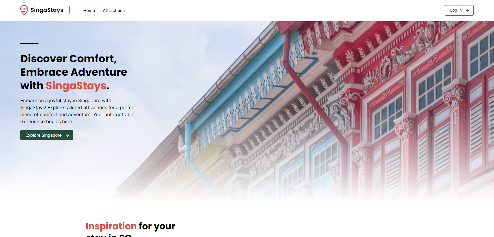
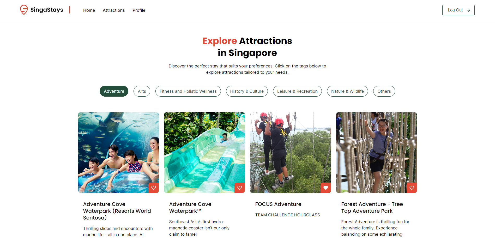
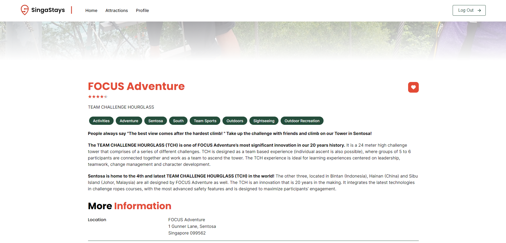
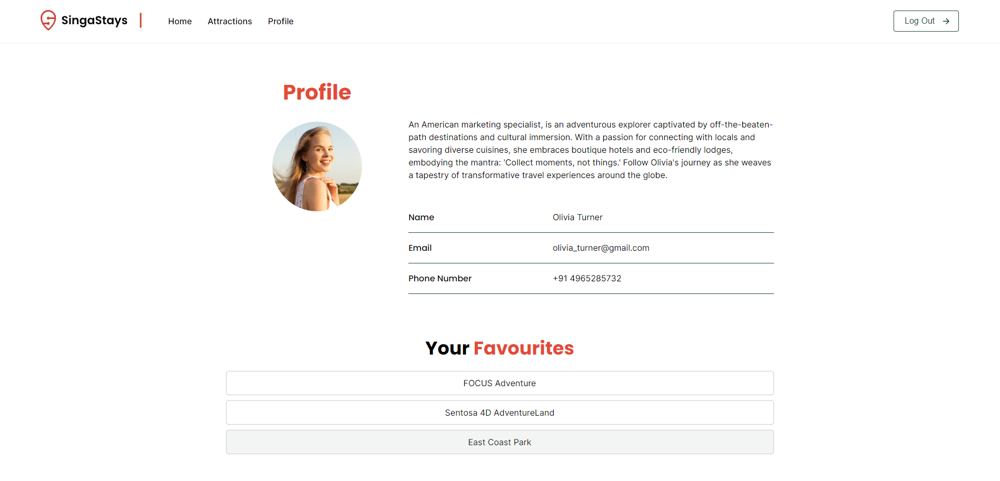

# SingaStays

SingaStays is a mock website designed to help users find attractions in Singapore. Users can browse by categories, view details, and add to favourites.

[Live Site](https://singastays-lx.netlify.app/)

## Features

- Browse by categories
- View detailed information for each attraction
- Add attraction to favourites
- View favourites in profile

## Tech Stack

- React JS

## Limitations

- SingaStays is a mock website and does not have user management capabilities. The user profile is currently a placeholder and is not customisable.
- Favorites are lost upon reloading or navigating out of the site.

## API Connection

SingaStays connects to third-party APIs to fetch information about attractions in Singapore. The API provides data such as attraction categories, names, descriptions, images, and more information. The project utilises this data to populate the attraction listings and details pages.

The APIs used in this project are [TIH Content User APIs](https://tih-dev.stb.gov.sg/content-api/apis).

## Group Contributions

This project was originally developed by a team of contributors. The key features and initial implementation were done by:

- Lin Xuan: Worked on attraction detail page, favourites
- Aishah: Worked on baseline codes (BrowserRouters, Routes, etc), responsive design, favourites
- YH: User profile page, favourites
- Travis: Homepage, attractions listing page
- Daniel: Homepage, attractions listing page, favourites

[Original Live Site](https://singastays.netlify.app/)

[Original GitHub Repository](https://github.com/Aishahaha/ntu-project-1)

## Individual Contributions

After the group project concluded, I continued to improve the project individually:

- Removed hardcoded API keys and implemented environment variables to enhance configurability.
- Added rewrite rules for Netlify to support client-side routing. Fixes 'Page Not Found' issue when user directly accesses or reloads pages that are not the home page.

## Screenshots

### Home Page

### Attractions Listing Page

Users can browse attractions by categories. By clicking on :white_heart:, users can add the attraction to their favourites.

### Attraction Detail Page

Users can view information for the attraction and add the attraction to their favourites by clicking on :white_heart:.

### Profile Page

Users can click on 'Log in' to view the profile page and their favourites.

## Live Site

Visit the live site here: [SingaStays](https://singastays-lx.netlify.app/)
